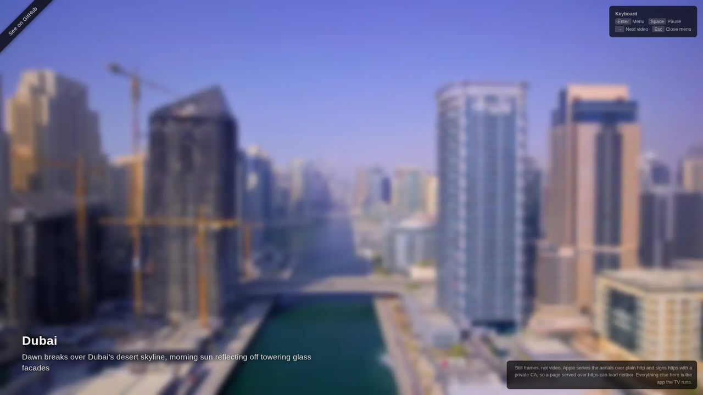

# Aerial for Samsung Tizen TV

Apple TV's aerial screensavers, running natively on a Samsung TV. 115 videos streamed from Apple's CDN and decoded in hardware as HEVC 4K through Samsung's AVPlay.

[**Try the demo**](https://jeancarlos.github.io/aerial-tizen/) — the real app in your browser, no TV needed.



| Category | Videos |
|---|---:|
| Space | 22 |
| Sea | 21 |
| Landscape | 42 |
| Cityscape | 30 |

Each video fades into the next and shows its title and description while it loads.

## Requirements

- A Samsung Smart TV on Tizen 6.0 or newer, which means a 2021 model or later.
- A PC on the same network segment as the TV.
- Either Docker, or the [Tizen Studio CLI](https://developer.tizen.org/development/tizen-studio/download).

You do not need a Samsung developer account. The TV accepts a package signed with the public distributor certificate that ships with Tizen Studio, and that is what the instructions below use.

## Install

### 1. Turn on developer mode

On the TV: open Apps, type `12345` on the remote, turn Developer mode on, enter your PC's IP address, and restart the TV.

### 2. Find the TV's address

Check your router's DHCP leases, or scan for the sdb port:

```bash
nmap -p 26101 --open 192.168.0.0/24
```

Check it again if anything times out later. DHCP renewal moves the address, and a stale one looks exactly like a TV that is switched off.

### 3. Deploy with Docker

Nothing to install locally.

```bash
docker run --rm --network=host -v "$PWD:/app:ro" vitalets/tizen-webos-sdk bash -lc '
  TV=<tv-ip>:26101
  sdb connect $TV
  DEVICE=$(sdb devices | awk "NR>1 {print \$3; exit}")

  STAGE=/tmp/stage; mkdir -p $STAGE/js $STAGE/css
  cp /app/config.xml /app/icon.png /app/index.html $STAGE/
  cp /app/css/style.css $STAGE/css/
  for n in catalog storage telemetry settings player menu debug main; do cp /app/js/$n.js $STAGE/js/; done
  [ -f /app/js/local-config.js ] && cp /app/js/local-config.js $STAGE/js/
  cp -r /app/preload $STAGE/preload

  tizen package -t wgt -s dev -- $STAGE
  mv "$STAGE/Aerial Screensaver.wgt" $STAGE/aerial.wgt
  tizen install -n aerial.wgt -t $DEVICE -- $STAGE
  tizen run -p AerialScr0.AerialScreensaver -t $DEVICE
'
```

The image carries a working `dev` signing profile, so there is no certificate to set up. `js/local-config.js` is optional and only exists if you have set up your own video server or telemetry, both covered in [DEVELOPMENT.md](DEVELOPMENT.md).

Do not run `tizen cli-config profiles.path=...`. It breaks profile resolution and packaging then fails with an unhelpful message.

### 4. Or deploy with a local Tizen Studio

```bash
./setup.sh     # asks for the Tizen Studio path, TV address and profile, writes .env
./deploy.sh    # stages the runtime files, packages, installs, launches
```

## Using it

| Key | Action |
|---|---|
| `Enter` | Open settings |
| `→`, `Fast Forward`, `Ch+`, `Ch−` | Next video |
| `Play`, `Pause`, `Play-Pause` | Pause and resume |
| `Back`, `Stop` | Exit |

In the settings menu, `↑` and `↓` move, `←` and `→` change a value, `Enter` toggles, and `Back` closes.

| Setting | Values | Notes |
|---|---|---|
| Show Description | On, Off | The title and description overlay |
| Description Timer | 1–15s | How long the overlay stays up |
| Video Order | Shuffle, Sequential | Shuffle never repeats the video that just played |
| Category | All, Space, Sea, Landscape, Cityscape | Changing it restarts playback in the new category |

Settings and the last video played survive a reboot.

## Troubleshooting

**`install failed[118, -11] Author certificate not match`** — a build signed with a different certificate is already installed. Remove it and install again. This clears the app's stored settings.

```bash
sdb -s <tv-ip>:26101 uninstall AerialScr0
```

Use `sdb` for this. `tizen uninstall` and `vd_uninstallapp` fail silently here. Keep your author certificate after the first install and you will not hit this again.

**Every command times out** — the TV's address changed. Repeat step 2.

**Packaging fails with "An error has occurred"** — look in `~/tizen-studio-data/cli/logs/cli.log`. A `profiles.path` entry in the CLI config is the usual cause.

**A video never starts** — the app retries the video on its own and moves to the next one when it runs out of options, so a single bad file costs you nothing but a pause. If every video fails, the catalog is likely stale; open an issue.

## Development

[DEVELOPMENT.md](DEVELOPMENT.md) covers running the app without a TV, the developer menu and on-screen debug board, playing from your own LAN server, telemetry, and how the player recovers from failures. [CONTRIBUTING.md](CONTRIBUTING.md) covers the constraints a patch has to respect.

## Thanks

Inspired by [xscreensaver-aerial](https://github.com/graysky2/xscreensaver-aerial) by graysky2.

## Author

Jean Souza — [jeansouza.dev](https://jeansouza.dev) · [github.com/jeancarlos](https://github.com/jeancarlos)

## License

MIT. Copyright (c) 2026 Jean.

Apple's aerial videos belong to Apple. This app streams them from their public CDN.
