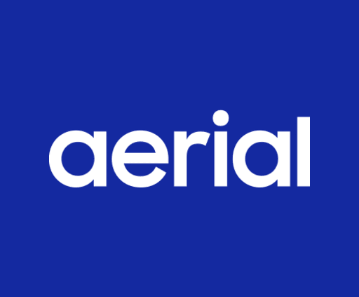

# Aerial Screensaver for Samsung Tizen TV

<p align="center">
  
</p>

---

Apple TV aerial screensaver videos playing natively on Samsung Smart TVs. Uses Samsung's AVPlay API for hardware-decoded HEVC 4K playback with smooth fade transitions between videos.

115 verified 4K aerial videos from Apple's CDN across four categories: Space (ISS orbital views), Sea (underwater wildlife), Landscape (national parks and glaciers), and Cityscape (world cities at golden hour). Each video shows a title and description overlay while it loads.

## Thanks

Inspired by [xscreensaver-aerial](https://github.com/graysky2/xscreensaver-aerial) by graysky2.

---

## Requirements

- Samsung Smart TV with **Tizen 6.0+** (2021 models or newer)
- Linux, macOS, or Windows PC on the **same network segment** as the TV
- [Tizen Studio CLI](https://developer.tizen.org/development/tizen-studio/download), or Docker if you prefer the containerised route below
- Node.js, only to run the test suite

A Samsung developer account is **not** required. The TV accepts a package signed with the Tizen public distributor certificate that ships with Tizen Studio, which is what the instructions below use. A Samsung distributor certificate is needed only for store submission or for partner-level privileges, neither of which this app uses.

---

## How it works

The app is plain HTML, CSS and JavaScript with no build step and no dependencies. Scripts load in a fixed order and share state through globals:

| File | Responsibility |
|---|---|
| `js/local-config.js` | Optional, untracked. Deployment-specific values: LAN media server, telemetry credentials. |
| `js/telemetry.js` | Optional event reporting. Silent and network-free unless configured. |
| `js/catalog.js` | Generated. `var CATALOG = [{url, label, description, category}]`. |
| `js/settings.js` | Defaults, the menu model, persistence, range clamping. |
| `js/player.js` | Playlist, thumbnail preload, info overlay, AVPlay lifecycle, retry ladder, stall watchdog. |
| `js/menu.js` | The settings menu and the LAN server connection test. |
| `js/main.js` | Remote key handling, app lifecycle, start-up. |

`js/catalog.js`, `js/h264map.js` and `preload/*.webp` are **generated artifacts**, produced by a separate tool that verifies every link against Apple's CDN before listing it and extracts each thumbnail from a frame of its own video. Edit them by hand only for a quick experiment; a regeneration will overwrite them.

### Playback and failure handling

Apple's CDN drops connections under load — measured: 22 of 114 URLs failed on a first parallel probe and every one served video on a retry. The player therefore treats a single failure as noise, not as a dead video:

1. Each URL is tried, then retried twice with 1s and 3s waits.
2. Then the next URL in the list is tried. The list is the catalog URL and its https form, preceded by the LAN URL when a custom server is enabled.
3. When every URL fails, the app waits 2s and moves to another video.
4. A 20s watchdog covers three distinct hangs: a prepare that never calls back, an initial buffer that never completes, and a stall in the middle of a video. Each one enters the ladder above instead of freezing the screen.

Every failure is logged with its URL and reason, so a full pass over the catalog produces the list of videos a given TV cannot play.

### Storage

Settings and the playback position are written through `tizen.preference`, with `localStorage` as a fallback for the desktop simulator. `localStorage` alone is not reliable on a TV: Chromium commits it lazily, so values written just before the app exits are lost.

---

## Install

### 1. Enable Developer Mode on the TV

1. Open **Apps**.
2. Type `12345` on the remote.
3. Turn **Developer mode** on.
4. Enter the **IP address of the PC** you will deploy from.
5. Restart the TV.

### 2. Find the TV's address

Check your router's DHCP leases for the TV's hostname, or scan for the sdb port:

```bash
nmap -p 26101 --open 192.168.0.0/24
```

Do not assume an address from an earlier session: a DHCP renewal moves the TV, and every step below will fail against a stale address with timeouts that look like the TV is off.

### 3. Deploy with Docker (no local SDK install)

```bash
docker run --rm --network=host -v "$PWD:/app:ro" vitalets/tizen-webos-sdk bash -lc '
  TV=<tv-ip>:26101
  sdb connect $TV
  DEVICE=$(sdb devices | awk "NR>1 {print \$3; exit}")

  STAGE=/tmp/stage; mkdir -p $STAGE/js $STAGE/css
  cp /app/config.xml /app/icon.png /app/index.html $STAGE/
  cp /app/css/style.css $STAGE/css/
  for n in catalog settings player menu main; do cp /app/js/$n.js $STAGE/js/; done
  cp -r /app/preload $STAGE/preload

  tizen package -t wgt -s dev -- $STAGE
  mv "$STAGE/Aerial Screensaver.wgt" $STAGE/aerial.wgt
  tizen install -n aerial.wgt -t $DEVICE -- $STAGE
  tizen run -p AerialScr0.AerialScreensaver -t $DEVICE
'
```

The image ships a working `dev` signing profile, so no certificate setup is needed. Do not run `tizen cli-config profiles.path=...`: it breaks profile resolution and packaging fails with a bare "An error has occurred".

### 4. Or deploy with a local Tizen Studio

```bash
./setup.sh     # asks for the Tizen Studio path, TV address and profile, writes .env
./deploy.sh    # stages the runtime files, packages, installs, launches
```

`deploy.sh` packages from a staging directory, so tests, the simulator, the H264 map and the scripts never ship inside the `.wgt`.

---

## Running without a TV

`simulate.html` mocks the Samsung APIs and plays the 1080p H264 variants, which browsers can decode:

```bash
python3 -m http.server 8080
# open http://localhost:8080/simulate.html
```

Keyboard: `Enter` opens the menu, `Space` pauses, `→` skips, `Esc` closes the menu. A 404 for `js/local-config.js` in the console is expected — that file is untracked and optional.

The simulator is the only way to exercise the app without hardware, so keep it working when you change the player.

---

## Tests

```bash
./test/run-all.sh
```

- `test/player.test.js` drives the player against stubbed Samsung APIs with controllable timers: cancellation of stale work, the retry ladder, watchdog coverage, category restarts, settings clamping and persistence.
- `test/catalog-sync.test.sh` checks the generated data: every catalog URL has a thumbnail, no orphan thumbnails, no duplicate URLs, every URL is http, and the H264 map matches the catalog.

A test here must fail if the behaviour it names is deleted. When you add one, delete the implementation line it covers and confirm the test goes red.

---

## Remote control

| Key | Action |
|---|---|
| `Enter` | Open the settings menu |
| `→`, `Fast Forward`, `Ch+`, `Ch−` | Next video |
| `Play` / `Pause` / `Play-Pause` | Pause and resume |
| `Back`, `Stop` | Exit the app |
| `1` `2` `3` `4` `5` | Reveal the developer rows in the menu |

Inside the menu: `↑` `↓` move, `←` `→` change a value, `Enter` toggles, `Back` closes.

---

## Settings

| Setting | Values | Notes |
|---|---|---|
| Show Description | On, Off | The overlay doubles as the loading indicator |
| Description Timer | 1–15s | Clamped on load |
| Video Order | Shuffle, Sequential | Shuffle avoids repeating the current video |
| Category | All, Space, Sea, Landscape, Cityscape | Changing it restarts the list |
| Use custom server | Yes, No | Developer rows only |
| Files location | URL | Developer rows only |

### Playing from a LAN server

Hosting the videos locally removes the CDN as a failure source. Create `js/local-config.js` (untracked; see `js/local-config.example.js`):

```js
var AERIAL_LOCAL_SERVER = 'http://<host>:<port>';
```

The app then defaults to that server with the catalog URL kept as a fallback, so a server that is down degrades to Apple's CDN instead of a black screen. Serve the files flat, named exactly as the catalog's basenames, with byte-range support.

### Telemetry

Off by default and absent from the repository. To enable it, add credentials to the same untracked file:

```js
var AERIAL_TELEMETRY = { clientToken: '<datadog client token>', site: 'datadoghq.com' };
```

Events: `app_start`, `buffering_complete` with a start-up duration, `avplay_failure` and `watchdog_timeout` with the URL, attempt and reason, and `video_skipped`. Failures also reach the console, so `sdb dlog` shows them without any external service.

---

## Troubleshooting

**`install failed[118, -11] Author certificate not match`** — a build signed with a different author certificate is already installed. Remove it and install again:

```bash
sdb -s <tv-ip>:26101 uninstall AerialScr0
```

`tizen uninstall` and the `vd_uninstallapp` shell helpers fail silently here; the sdb subcommand is the one that works. Uninstalling clears the app's stored settings. Keep your author certificate after the first install, or every update will need this step.

**Every command times out** — the TV's address changed. See step 2.

**Packaging fails with "An error has occurred"** — check `~/tizen-studio-data/cli/logs/cli.log`. A common cause is a `profiles.path` entry in the CLI config.

**A video never starts** — the watchdog moves on after 20s. If it happens on every video, the catalog may be stale; regenerate it, or test one URL by hand with `ffprobe`.

**The thumbnail stays on screen** — the app is waiting for AVPlay to report that buffering finished. Check the log for `avplay_failure`.

---

## Contributing

See [CONTRIBUTING.md](CONTRIBUTING.md). Short version: no build step, no dependencies, ES5-era syntax only (the runtime is Chromium 76), both test suites green, and generated files left alone.

## License

MIT. Apple's aerial videos are Apple's; this app only links to their public CDN.
